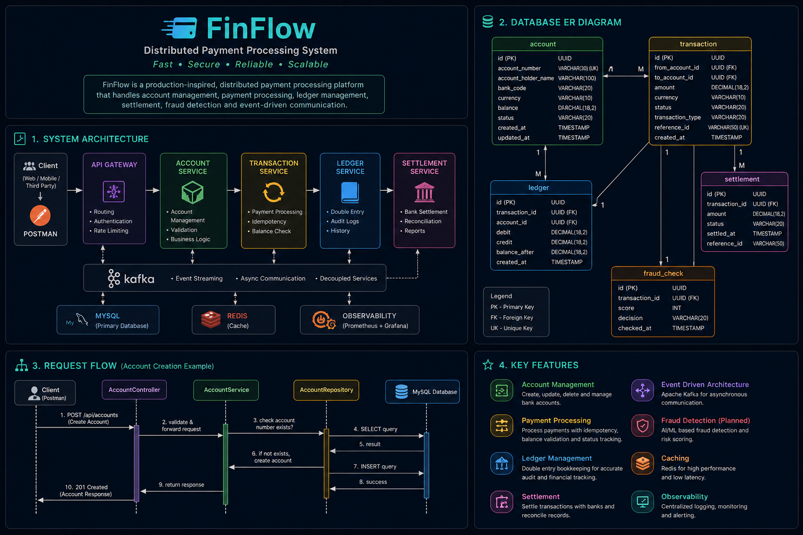

# 💳 FinFlow

> A production-inspired distributed payment processing platform built using Java 21, Spring Boot, and MySQL.

    

---

## 📖 About

FinFlow is a production-inspired backend project that simulates how modern payment platforms process financial transactions.

Rather than focusing on basic CRUD operations, the project explores enterprise backend concepts such as layered architecture, transaction processing, ledger management, idempotency, event-driven communication, settlement, fraud detection, and scalable system design.

---

## ✨ Vision

The objective of FinFlow is to evolve into a complete distributed payment processing platform inspired by systems such as Stripe, Razorpay, and PhonePe while following clean architecture and industry best practices.

---

## 🏗️ Documentation

- 📐 Architecture → `docs/architecture.md`
- 🗄️ Database Design → `docs/database-design.md`
- 📚 API Reference → `docs/api-reference.md`
- ⚙️ System Design → `docs/system-design.md`
- 🚀 Deployment Guide → `docs/deployment.md`

---

## 🛠️ Tech Stack

| Technology | Version |
|------------|---------|
| Java | 21 |
| Spring Boot | 4.x |
| MySQL | 8.x |
| Hibernate | ORM |
| Maven | Build Tool |
| Git | Version Control |
| Postman | API Testing |

---

## 🚧 Project Status

FinFlow is actively being developed.

Current implementation includes the Account Management module with layered architecture, validation, persistence, and centralized exception handling.

Additional modules will be introduced incrementally following production-oriented design principles.

---

## 👩‍💻 Author

**Mayuri Pawar**

B.Tech Electronics & Computer Engineering

Passionate about Java Backend Development, Distributed Systems, and System Design.
